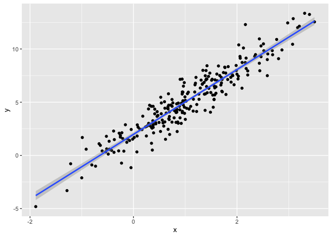
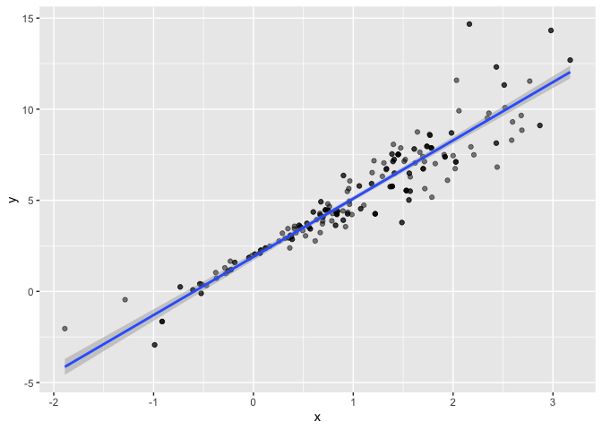
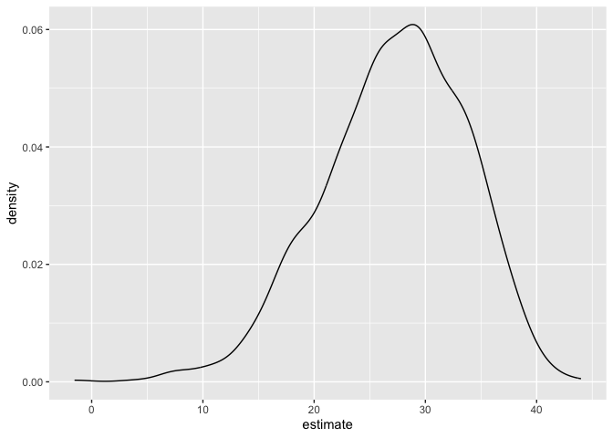

Bootstrapping
================
Zeqi Li
2024-11-12

# Generate data

``` r
n_samp = 250

sim_df_constant = tibble(x = rnorm(n_samp, 1, 1),
                         error = rnorm(n_samp, 0, 1),
                         y = 2 + 3 * x + error)

sim_df_nonconstant = 
  sim_df_constant |> 
  mutate(error = error * 0.75 * x,
         y = 2 + 3 * x + error)
```

Look at the data

``` r
sim_df_constant |> 
  ggplot(aes(x = x,
             y = y)) +
  geom_point() +
  stat_smooth(method = "lm")
```

    ## `geom_smooth()` using formula = 'y ~ x'

<!-- -->

``` r
sim_df_nonconstant |> 
  ggplot(aes(x = x,
             y = y)) +
  geom_point() +
  stat_smooth(method = "lm")
```

    ## `geom_smooth()` using formula = 'y ~ x'

<!-- -->

Regression results

``` r
sim_df_constant |> 
  lm(y ~ x, data = _) |> 
  broom::tidy() |> 
  knitr::kable(digits = 3)
```

| term        | estimate | std.error | statistic | p.value |
|:------------|---------:|----------:|----------:|--------:|
| (Intercept) |    1.977 |     0.098 |    20.157 |       0 |
| x           |    3.045 |     0.070 |    43.537 |       0 |

``` r
sim_df_nonconstant |> 
  lm(y ~ x, data = _) |> 
  broom::tidy() |> 
  knitr::kable(digits = 3)
```

| term        | estimate | std.error | statistic | p.value |
|:------------|---------:|----------:|----------:|--------:|
| (Intercept) |    1.934 |     0.105 |    18.456 |       0 |
| x           |    3.112 |     0.075 |    41.661 |       0 |

# Draw bootstrap sample

``` r
boot_sample = function(df) {
  boot_df = sample_frac(df, replace = TRUE) |> 
    arrange(x)
  
  return(boot_df)
}
```

``` r
sim_df_nonconstant |> 
  boot_sample() |> 
  ggplot(aes(x = x,
             y = y)) +
  geom_point(alpha = 0.5) +
  stat_smooth(method = "lm")
```

    ## `geom_smooth()` using formula = 'y ~ x'

<!-- -->

Other analyses

``` r
sim_df_nonconstant |> 
  boot_sample() |> 
  lm(y ~ x, data = _) |> 
  broom::tidy() |> 
  knitr::kable(digits = 3)
```

| term        | estimate | std.error | statistic | p.value |
|:------------|---------:|----------:|----------:|--------:|
| (Intercept) |    1.896 |     0.098 |    19.311 |       0 |
| x           |    3.142 |     0.069 |    45.636 |       0 |

# Iterate bootstrapping

``` r
boot_straps = tibble(strap_number = 1:10) |> 
  mutate(strap_sample = map(strap_number, 
                           \(i) boot_sample(sim_df_nonconstant)),
         models = map(strap_sample,
                      \(df) lm(y ~ x, data = df)),
         results = map(models, broom::tidy))

bootstrap_results = boot_straps |> 
  select(strap_number, results) |> 
  unnest(results) |> 
  group_by(term) |> 
  summarize(boot_se = sd(estimate)) |> 
  knitr::kable(digits = 3)
```

# `modelr`

``` r
boot_straps = sim_df_nonconstant |> 
  modelr::bootstrap(1000) |> 
  mutate(strap = map(strap, as_tibble),
         models = map(strap, \(df) lm(y ~ x, data = df)),
         results = map(models, broom::tidy)) |> 
  select(.id, results) |> 
  unnest(results)

boot_straps
```

    ## # A tibble: 2,000 × 6
    ##    .id   term        estimate std.error statistic   p.value
    ##    <chr> <chr>          <dbl>     <dbl>     <dbl>     <dbl>
    ##  1 0001  (Intercept)     2.02    0.107       18.9 6.40e- 50
    ##  2 0001  x               3.03    0.0710      42.7 2.83e-116
    ##  3 0002  (Intercept)     1.92    0.0957      20.0 8.39e- 54
    ##  4 0002  x               3.14    0.0701      44.8 7.28e-121
    ##  5 0003  (Intercept)     1.91    0.101       18.9 5.66e- 50
    ##  6 0003  x               3.12    0.0689      45.3 6.46e-122
    ##  7 0004  (Intercept)     1.94    0.0907      21.3 4.66e- 58
    ##  8 0004  x               3.08    0.0680      45.4 3.99e-122
    ##  9 0005  (Intercept)     1.95    0.110       17.7 7.92e- 46
    ## 10 0005  x               3.13    0.0767      40.9 3.88e-112
    ## # ℹ 1,990 more rows

# Final result

``` r
boot_straps |> 
  group_by(term) |> 
  summarize(boot_est = mean(estimate),
            boot_se = sd(estimate),
            boot_ci_ul = quantile(estimate, .025),
            boot_ci_ll = quantile(estimate, .975))
```

    ## # A tibble: 2 × 5
    ##   term        boot_est boot_se boot_ci_ul boot_ci_ll
    ##   <chr>          <dbl>   <dbl>      <dbl>      <dbl>
    ## 1 (Intercept)     1.93  0.0746       1.79       2.08
    ## 2 x               3.11  0.101        2.91       3.31

# Airbnb

``` r
data("nyc_airbnb")

nyc_airbnb = 
  nyc_airbnb |> 
  mutate(stars = review_scores_location / 2) |> 
  rename(
    borough = neighbourhood_group,
    neighborhood = neighbourhood) |> 
  filter(borough != "Staten Island") |> 
  drop_na(price, stars) |> 
  select(price, stars, borough, neighborhood, room_type)
```

``` r
manhattan_df = 
  nyc_airbnb |> 
  filter(borough == "Manhattan") |> 
  modelr::bootstrap(n = 1000) |> 
  mutate(
    models = map(strap, \(df) lm(price ~ stars + room_type, data = df)),
    results = map(models, broom::tidy)) |> 
  select(results) |> 
  unnest(results) |> 
  filter(term == "stars")

manhattan_df |> 
  ggplot(aes(x = estimate)) + 
  geom_density()
```

<!-- -->
